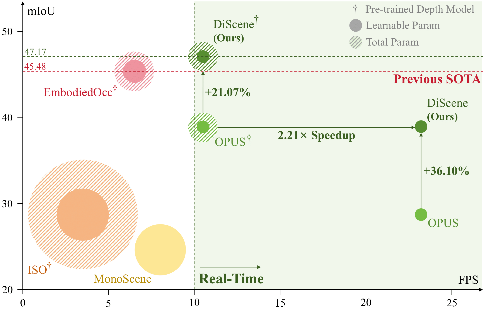
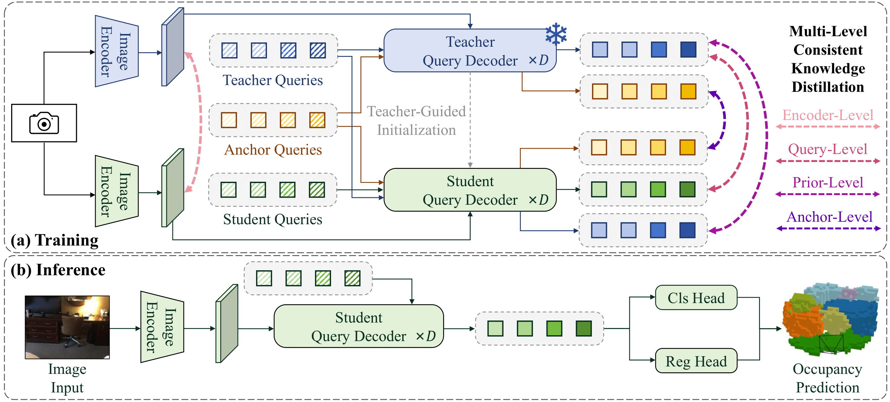

# DiScene

> **Enhancing Indoor Occupancy Prediction via Sparse Query-Based Multi-Level Consistent Knowledge Distillation**  [[paper](https://ieeexplore.ieee.org/document/11183690)]
>
> *RA-L 2025*

## TODO

- [x] Initial commit
- [ ] Model zoo
- [ ] arXiv version




## Introduction

Occupancy prediction provides critical geometric and semantic understanding for robotics but faces efficiency-accuracy trade-offs. Current dense methods suffer computational waste on empty voxels, while sparse query-based approaches lack robustness in diverse and complex indoor scenes. In this paper, we propose **DiScene**, a novel sparse query-based framework that leverages multi-level distillation to achieve efficient and robust occupancy prediction. In particular, our method incorporates two key innovations: (1) a **Multi-level Consistent Knowledge Distillation** strategy, which transfers hierarchical representations from large teacher models to lightweight students through coordinated alignment across four levels, including encoder-level feature alignment, query-level feature matching, prior-level spatial guidance, and anchor-level high-confidence knowledge transfer and (2) a **Teacher-Guided Initialization** policy, employing optimized parameter warm-up to accelerate model convergence. Validated on the Occ-Scannet benchmark, DiScene achieves 23.2 FPS without depth priors while outperforming our baseline method, OPUS, by 36.1% and even better than the depth-enhanced version, OPUS†. With depth integration, DiScene† attains new SOTA performance, surpassing EmbodiedOcc by 3.7% with 1.62× faster inference speed. Furthermore, experiments on the Occ3D-nuScenes benchmark and in-the-wild scenarios demonstrate the versatility of our approach in various environments.



## Getting Started

### Installation

Follow instructions [HERE](docs/install.md) to prepare the environment. 

### Data Preparation

Please download **posed_images** and **gathered_data** from the [Occ-ScanNet Benchmark](https://huggingface.co/datasets/hongxiaoy/OccScanNet) and move them to **data/occscannet**, zip files need extraction.

**Folder structure**
```
DiScene
├── ...
├── data/
│   ├── occscannet/
│   │   ├── gathered_data/
│   │   ├── posed_images/
│   │   ├── train.txt
│   │   ├── test.txt
├── ...
```

### Train and Eval

1. Train different models using 8 GPUs on Occ-ScanNet Benchmark:
    ```bash
    # train student model
    bash dist_train.sh 8 configs/occscannet/r50/discene_960x16_student_r50.py

    # train teacher model
    bash dist_train.sh 8 configs/occscannet/internxl/discene_960x16_teacher_internxl.py

    # train distilled model (DiScene†)
    bash dist_train.sh 8 configs/occscannet/r50/discene_960x16_guided_distill_r50.py  # Please modify 'teacher_weight' in the configuration file accordingly.

    # training without pre-trained depth model
    # student model
    bash dist_train.sh 8 configs/occscannet/r50/discene_960x16_vanilla_r50.py
    # teacher model
    bash dist_train.sh 8 configs/occscannet/internxl/discene_960x16_teacher_vanilla_internxl.py
    # distilled model (DiScene)
    bash dist_train.sh 8 configs/occscannet/r50/discene_960x16_guided_distill_vanilla_r50.py  # Please modify 'teacher_weight' in the configuration file accordingly.
    ```

2. Evaluate model using 8 GPUs on Occ-ScanNet Benchmark:
    ```bash
    # evaluate distilled model (DiScene†)
    bash dist_val.sh 8 configs/occscannet/r50/discene_960x16_guided_distill_r50.py /path/to/checkpoints
    ```

## Model Zoo

#### 3D Occupancy Prediction (on Occ-Scannet Benchmark)

|          Method           | mIoU  |                            Config                            | Checkpoints |
| :-----------------------: | :---: | :----------------------------------------------------------: | :---------: |
| DiScene† |  47.17 | [config](configs/occscannet/r50/discene_960x16_guided_distill_r50.py) |   Coming soon... 🏗️ 🚧 🔨    |

## Acknowledgement

Our code is developed on top of [OPUS](https://github.com/jbwang1997/OPUS). We sincerely appreciate their amazing works.

Also, we would like to thank these excellent open source projects:

- [ISO](https://github.com/hongxiaoy/ISO)
- [EmbodiedOcc](https://github.com/YkiWu/EmbodiedOcc)
- [Metric3D](https://github.com/YvanYin/Metric3D)
- [Depth Anything V2](https://github.com/DepthAnything/Depth-Anything-V2.git)

## Bibtex
If you find this work useful, please consider citing:

```
@article{li2025enhancing,
  title={Enhancing Indoor Occupancy Prediction Via Sparse Query-Based Multi-Level Consistent Knowledge Distillation},
  author={Li, Xiang and Zheng, Yupeng and Li, Pengfei and Chen, Yilun and Zhang, Ya-Qin and Ding, Wenchao},
  journal={IEEE Robotics and Automation Letters},
  year={2025},
  volume={10},
  number={11},
  pages={11690-11697},
  doi={10.1109/LRA.2025.3615532}
}
```